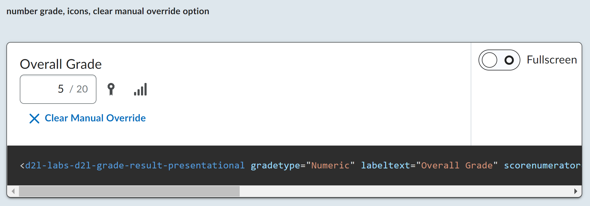
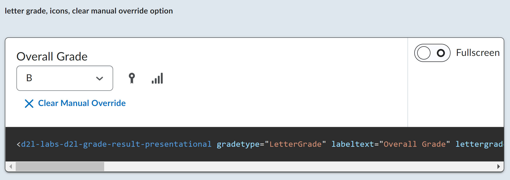

# @d2l/labs-grade-result

> Note: this is a ["labs" component](https://daylight.d2l.dev/developing/getting-started/component-tiers/). While functional, these tasks are prerequisites to promotion to BrightspaceUI "official" status:
>
> - [ ] [Design organization buy-in](https://daylight.d2l.dev/developing/creating-component/before-building/#working-with-design)
> - [ ] [Architectural sign-off](https://daylight.d2l.dev/developing/creating-component/before-building/#web-component-architecture)
> - [x] [Continuous integration](https://daylight.d2l.dev/developing/testing/tools/#continuous-integration)
> - [x] [Cross-browser testing](https://daylight.d2l.dev/developing/testing/cross-browser/)
> - [x] [Unit tests](https://daylight.d2l.dev/developing/testing/tools/) (if applicable)
> - [x] [Accessibility tests](https://daylight.d2l.dev/developing/testing/accessibility/)
> - [x] [Visual diff tests](https://daylight.d2l.dev/developing/testing/visual-difference/)
> - [x] Localization with Serge (if applicable)
> - [x] Demo page
> - [x] README documentation

A web component used for rendering grades in Brightspace




## Properties

#### d2l-labs-d2l-grade-result

| Property                          | Type      | Default     | Description                                                  |
| ----------------------------------| --------- | -------     | ------------------------------------------------------------ |
| `href`                            | `string`  | `''`        | The Hypermedia route to power the component. This component runs off of the /grade route or an activity. |
| `token`                           | `string`  | `''`        | For authentication                                           |
| `disableAutoSave`                 | `boolean` | `false`     | Prevent the component from automatically saving the grade to the API when the grade is changed. |
| `_hideTitle`                      | `boolean` | `false`     | This property will hide the "Overall Grade" title above the component. |
| `customManualOverrideText`        | `string`  | `undefined` | This properly will substitute the stock text on the "Manual Override" button. |
| `customManualOverrideClearText`   | `string`  | `undefined` | This properly will substitute the stock text on the "Clear Manual Override" button. |

##### Public Methods

| Method                         | Description                                                  |
| ------------------------------ | ------------------------------------------------------------ |
| `saveGrade(): void`            | This is the method used to manually save the grade to the server when `disableAutoSave = true`. This method will emit `@d2l-grade-result-grade-saved-success` or `@d2l-grade-result-grade-saved-error`. |
| `hasUnsavedChanges(): boolean` | Determines whether the grade has been changed by the user and has not been saved to the server yet. |

If you are only interested in rendering the presentational layer of the component, you can simply use the `d2l-grade-result-presentational` component.

#### d2l-labs-d2l-grade-result-presentational

| Property                          | GradeType      | Type                        | Default     | Description                                                  |
| ----------------------------------| -------------- | --------------------------- | ----------- | ------------------------------------------------------------ |
| `gradeType`                       | All            | `string ('Numeric' or 'LetterGrade')` | `'Numeric'` | Specifies the type of grade that the component is meant to render. |
| `labelText`                       | All            | `string`                    | `''`        | The text that appears above the component.                   |
| `scoreNumerator`                  | Numeric        | `number`                    | `0`         | The numerator of the numeric score that is given.            |
| `scoreDenominator`                | Numeric        | `number`                    | `0`         | The denominator of the numeric score that is given.          |
| `selectedLetterGrade`             | LetterGrade    | `string`                    | `''`        | The current selected letter grade of the options given.      |
| `letterGradeOptions`              | LetterGrade    | `Object`                    | `null`      | A dictionary where the key is a unique id and the value is an object containing the LetterGrade text and the PercentStart. |
| `includeGradeButton`              | All            | `boolean`                   | `false`     | Determines whether the grades icon button is rendered.       |
| `includeReportsButton`            | All            | `boolean`                   | `false`     | Determines whether the reports icon button is rendered.      |
| `gradeButtonTooltip`              | All            | `string`                    | `''`        | The text that is inside of the tooltip when hovering over the grades button. |
| `reportsButtonTooltip`            | All            | `string`                    | `''`        | The text that is inside of the tooltip when hovering over the reports button. |
| `readOnly`                        | All            | `boolean`                   | `false`     | Set to `true` if the user does not have permissions to edit the grade. |
| `isManualOverrideActive`          | All            | `boolean`                   | `false`     | Set to `true` if the user is currently manually overriding the grade. This will display the button to 'Clear Manual Override'. |
| `hideTitle`                       | All            | `boolean`                   | `false`     | This property will hide the "Overall Grade" title above the component. |
| `customManualOverrideClearText`   | All            | `string`                    | `undefined` | This property will substitute the stock text on the "Clear Manual Override" button. |
| `subtitleText`                    | All            | `string`                    | `undefined` | This property will show the given text under the title. |
| `required`                 | Numeric        | `Boolean`                    | `false` | Set to `true` if an undefined/blank grade is not considered valid |
| `inputLabelText`                 | Numeric        | `string`                    | `''` |  This property sets the label that will be used inside the aria-label and validation error tool-tips |
| `allowNegativeScore`             | Numeric        | `boolean`                    | `'false'`   | Set to `true` if negative scores can be entered                         |
| `showFlooredScoreWarning`        | Numeric        | `boolean`                    | `'false'`   | Set to `true` if displaying a negative grade that has been floored at 0 |

## Events

#### d2l-labs-d2l-grade-result

| Event                                           | Description                                                  |
| ----------------------------------------------- | ------------------------------------------------------------ |
| `@d2l-grade-result-initialized-success`         | This event is fired when the component is successfully initialized and a grade is loaded from the API. |
| `@d2l-grade-result-initialized-error`           | This event is fired when there is an error initializing the component. This is usually caused by an invalid `href` or `token`. |
| `@d2l-grade-result-grade-updated-success`       | This event is fired when the grade is successfully updated on the frontend. |
| `@d2l-grade-result-grade-updated-error`         | This event is fired when there is an error updating the grade on the frontend. |
| `@d2l-grade-result-grade-saved-success`         | This event is fired when the grade is successfully saved to the server. |
| `@d2l-grade-result-grade-saved-error`           | This event is fired when there is an error while saving the grade to the server. |
| `@d2l-grade-result-grade-button-click`          | This event is fired when the grades button is clicked.       |
| `@d2l-grade-result-reports-button-click`        | This event is fired when the reports button is clicked.      |
| `@d2l-grade-result-manual-override-clear-click` | This event is fired when the manual override clear is clicked. |

#### d2l-labs-d2l-grade-result-presentational

| Event                                           | Description                                                  |
| ----------------------------------------------- | ------------------------------------------------------------ |
| `@d2l-grade-result-grade-button-click`          | This event is fired when the grades button is clicked.       |
| `@d2l-grade-result-reports-button-click`        | This event is fired when the reports button is clicked.      |
| `@d2l-grade-result-grade-change`                | This event is fired on the change of the grade for a `gradeType="Numeric"` grade. |
| `@d2l-grade-result-letter-score-selected`       | This event is fired on the change of the grade for a `gradeType="LetterGrade"` grade. |
| `@d2l-grade-result-manual-override-clear-click` | This event is fired when the manual override clear is clicked. |

## Installation

To install from NPM:

```shell
npm install @d2l/labs-grade-result
```

## Usage

```html
<script type="module">
    import '@d2l/labs-grade-result/d2l-grade-result.js';
</script>
<d2l-labs-d2l-grade-result href="href" token="token" disableAutoSave _hideTitle>My element</d2l-labs-d2l-grade-result>
```

## Developing, Testing and Contributing

After cloning the repo, run `npm install` to install dependencies.

### Linting

```shell
# eslint and lit-analyzer
npm run lint

# eslint only
npm run lint:eslint
```

### Testing

```shell
# lint & run headless unit tests
npm test

# unit tests only
npm run test:headless

# debug or run a subset of local unit tests
npm run test:headless:watch
```

### Visual Diff Testing

This repo uses the [@brightspace-ui/visual-diff utility](https://github.com/BrightspaceUI/visual-diff/) to compare current snapshots against a set of golden snapshots stored in source control.

The golden snapshots in source control must be updated by the [visual-diff GitHub Action](https://github.com/BrightspaceUI/actions/tree/main/visual-diff).  If a pull request results in visual differences, a draft pull request with the new goldens will automatically be opened against its branch.

To run the tests locally to help troubleshoot or develop new tests, first install these dependencies:

```shell
npm install @brightspace-ui/visual-diff@X  --no-save
```

Replace `X` with [the current version](https://github.com/BrightspaceUI/actions/tree/main/visual-diff#current-dependency-versions) the action is using.

Then run the tests:

```shell
# run visual-diff tests
npx mocha './test/**/*.visual-diff.js' -t 10000
# subset of visual-diff tests:
npx mocha './test/**/*.visual-diff.js' -t 10000 -g some-pattern
# update visual-diff goldens
npx mocha './test/**/*.visual-diff.js' -t 10000 --golden
```

### Running the demos

To start a [@web/dev-server](https://modern-web.dev/docs/dev-server/overview/) that hosts the demo page and tests:

```shell
npm start
```

### Versioning and Releasing

This repo is configured to use `semantic-release`. Commits prefixed with `fix:` and `feat:` will trigger patch and minor releases when merged to `main`.

To learn how to create major releases and release from maintenance branches, refer to the [semantic-release GitHub Action](https://github.com/BrightspaceUI/actions/tree/main/semantic-release) documentation.
