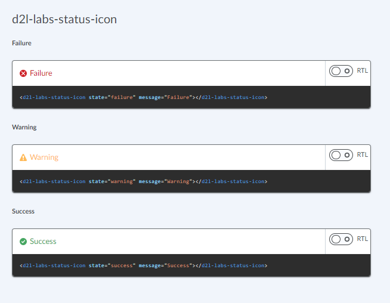

# d2l-labs-status-icon

Displays an icon as well as optional text to show the state/status of some feature or tool

## Usage

```html
<script type="module">
    import '@brightspace-ui-labs/status-icon/status-icon.js';
</script>
<d2l-labs-status-icon state="failure" message="Failure"></d2l-labs-status-icon>
```



**Properties:**

| Property | Type | Description |
|--|--|--|
| `message` | String | Message to be displayed |
| `state` | String, default: `'failure'` | State of the status. Can be one of  `failure`, `warning`, `success`. |
